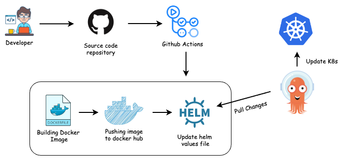
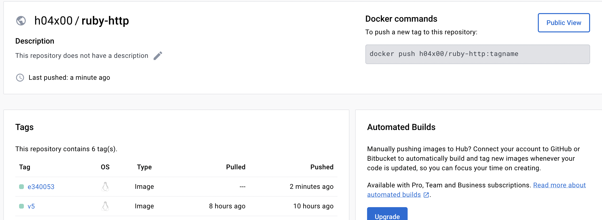
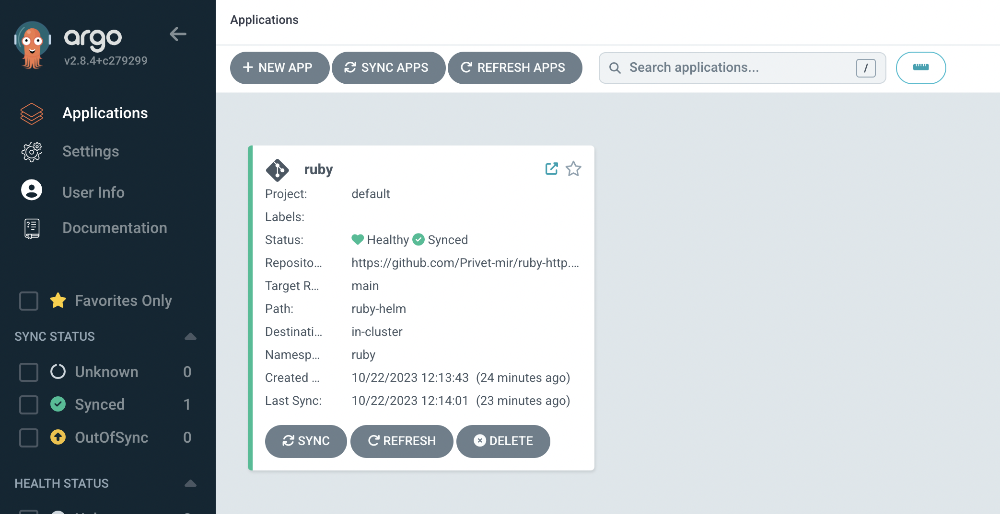

# Ruby HTTP

## Table of Contents
- [Prerequisites](#prerequisites)
- [Features](#features)
- [ClusterSetup](#clustersetup)
- [Design](#design)
- [Build](#build)
- [Deploy](#deploy)
- [Monitoring](#monitoring)
- [Improvements](#improvements)

## Prerequisites

Before deploying Ruby HTTP application on Kubernetes, ensure that you have the following tools and resources set up:

- **Kubernetes Cluster**: You should have a running Kubernetes cluster where you want to install the components. If you don't have one, you can set up a local cluster using [minikube](https://minikube.sigs.k8s.io/docs/start/) or [kind](https://kind.sigs.k8s.io/).

- **kubectl**: Ensure that you have [`kubectl`](https://kubernetes.io/docs/tasks/tools/install-kubectl-linux/) installed and properly configured to manage your Kubernetes cluster.

- **Helm**: [Helm](https://helm.sh/) is required for installing Prometheus, ArgoCD, and other components. Make sure Helm is installed and initialized.

- **argocd-project.yaml**: This configuration file defines your ArgoCD application. Make sure it's available and properly configured.

- **kind.yaml**: This file contains the configuration for creating a local Kubernetes cluster using kind.

## Features
Task has following features
- **Automated Build and Deployment**: Builds are automatically triggered using Git Actions, and the application image is pushed to Docker Hub
- **GitOps Deployment**: Application is deployed using ArgoCD, a GitOps tool that ensures your cluster matches the desired state in your Git repository.
- **Monitoring with Prometheus and Grafana**: Cluster and application monitoring is achieved through Prometheus, and you can access comprehensive dashboards on Grafana.
- **Rolling Upgrades**: Any changes to the application are handled with rolling upgrades on Kubernetes, ensuring zero downtime.
- **Auto-Scaling**: The application can automatically scale based on CPU and Memory metrics. If CPU or Memory usage crosses a threshold of 80%, pods will be scaled accordingly.
- **Ingress for Accessibility**: The application is exposed via Ingress, making it accessible to external users.
- **Health Checks and Liveness Probes**: Application reliability is ensured using health checks and liveness probes. Kubernetes can automatically restart unhealthy containers.


## ClusterSetup

Setting up your Kubernetes cluster is the initial step to get application running. Follow these steps:

1. Clone this repository to your local machine and execute following commands:
   ```shell
   $: https://github.com/Privet-mir/ruby-http.git
   ```
2. Change your working directory to the `ruby-http` folder:
    ```shell
   $: cd ruby-http
    ```
3. Create a Kubernetes cluster using `kind`:
    ```shell
   $: kind create cluster --name tech-challenge --config kind.yaml
   ```

## Design

CI/CD Pipeline Design
</a>

In the image above, you can observe a seamless integration pipeline. The process begins with GitHub Actions, where we automate the building of a Docker image for our application and subsequently push this image to a DockerHub repository. We then ensure the latest image tag is updated in the Helm value file within our Git repository.

The key advantage of this pipeline is that every time code changes are made in the Application repository, an automated sequence of actions is triggered. First, a new Docker container image is created. Next, this image is pushed to DockerHub. Finally, we manually update the image tag within the Helm value file. This automated process ensures that the most recent version of our application is readily available for deployment.

## Build

Building and testing your application is an essential part of the deployment process:

1. Build the Docker image locally for testing.
   ```shell
    $: docker-compose -f docker-compose.yaml up -d
   ```
   This will
    * Build image using Dockerfile
    * Run container locally
    * Expose port 8000

2. Test the application locally by sending a request ```curl localhost:8000/healthcheck```

4. After local testing, push changes to your Git repository. Git Actions will automatically build the image and push it to Docker Hub. Each image is tagged with the first 7 characters of the commit ID for version control. 
</a>

## Deploy

Now, let's deploy Ruby HTTP application and related components.:

Helm chart for application is located in `ruby-helm`.

1. Run the `setup.sh` script to set up application and the necessary components:
    ```shell
    $: cd ruby-http
    $: chmod +x setup.sh
    # Application is deployed inside ruby namespace
    $: ./setup.sh
    ```
    The `setup.sh` script will perform the following tasks:

    * Install Ingress controller.
    * Install and configure Prometheus for monitoring.
    * Install ArgoCD for GitOps.
    * Install the Metrics Server and apply any necessary patches.
    * Log in to ArgoCD and add an application.


2. Access the ArgoCD interface in your web browser by navigating to `localhost:9000` and Ensure that the application is in sync with your Git repository.

    To log in, use the following credentials:
    * Username: admin
    
    You can retrieve the password with the following command:
    ```shell
    $: PASSWORD=$(kubectl -n argocd get secret argocd-initial-admin-secret -o jsonpath="{.data.password}" | base64 -d)
    $ echo $PASSWORD
    ```
    </a>

3. Test your deployed application:
    ```shell
    $: curl localhost/
    $: curl localhost/healthcheck
    ```
4. If you need to deploy new changes, update the `values.yaml` file inside the `ruby-helm` directory


## Monitoring

Monitoring is crucial to ensure the health and performance of the application. Here's how to access and use Prometheus and Grafana:

1. Access Grafana for metrics visualization by forwarding the port:
    ```shell
    $: kubectl port-forward svc/prometheus-grafana 3000:80 -n monitor &
    ```
    To log in, use the following credentials:
    * Username: admin
    
    You can retrieve the password with the following command:
    ```shell
    $: kubectl get secret --namespace monitor prometheus-grafana -o jsonpath="{.data.admin-password}" | base64 -d
    ```
</a>

## Improvements

- **Canary and Blue-Green Deployments**: Enhance deployment strategy by enabling canary or blue-green deployments using ArgoCD. 
- **Auto-Sync with Git**: Automate the synchronization process with Git by configuring ArgoCD to monitor your Git repository for changes.
- **Horizontal Pod Autoscaling (HPA)**: Configure Horizontal Pod Autoscaling based on custom metrics to scale your application dynamically in response to application-specific performance metrics. This can help your application handle varying workloads more efficiently.
- **Centralized Logging**: Set up a centralized logging solution, such as the ELK (Elasticsearch, Logstash, Kibana) stack or Fluentd, to collect and analyze logs from your application and cluster. This makes debugging and troubleshooting easier.
- **Security Scanning**: Integrate security scanning tools into your CI/CD pipeline to detect and address security vulnerabilities in your application and container images.